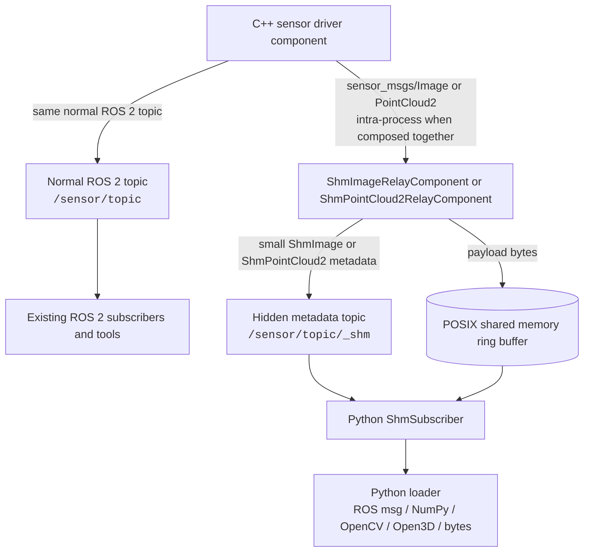

# shm_sensor_transport

`shm_sensor_transport` is a ROS 2 transport path for high-bandwidth, intra-host
sensor streams. It is intended for image and point-cloud pipelines where the
standard ROS 2 topic remains available, but Python consumers can avoid the cost
of deserializing large `sensor_msgs/Image` or `sensor_msgs/PointCloud2` messages
on every callback.

## Why

Many robotics perception systems are split between C++ sensor drivers and Python
processing code. ROS 2 keeps that split productive, but very large sensor
messages can become expensive when they cross into Python through normal rclpy
subscription paths. The data is already local to the machine, yet it still has to
move through DDS serialization, Python message construction, and downstream
conversion before the user callback can work with the pixels or points.

This package keeps normal ROS 2 compatibility and adds a local fast path:

- The original sensor topic is still published as `sensor_msgs/Image` or
  `sensor_msgs/PointCloud2`.
- A C++ relay subscribes to that topic and writes only the raw payload bytes into
  a fixed-size shared-memory ring buffer.
- The relay publishes a small ROS 2 metadata message that identifies the shared
  memory object, slot, sequence, and sensor layout.
- Python subscribers receive the metadata, copy the selected payload bytes from
  shared memory, validate that the slot was not overwritten during the copy, and
  pass loader output to user code.

The Python side still copies the payload before invoking callbacks. That copy is
intentional: it gives user code normal object lifetimes while allowing the C++
writer to keep reusing ring-buffer slots.

## Architecture

The transport has three ROS 2 packages:

- `shm_sensor_transport_interfaces`: message and service definitions shared by
  the C++ and Python packages.
- `shm_sensor_transport`: C++ relay components and shared-memory ring-buffer
  implementation.
- `shm_sensor_transport_py`: Python subscriber API, shared-memory handles, and
  loader plugins.

Typical data flow:



```text
Sensor driver process
  └── publishes /camera/image_raw as sensor_msgs/Image

C++ relay component
  ├── subscribes to /camera/image_raw
  ├── allocates /dev/shm/ros2_shm_camera_image_raw_<hash>
  ├── writes msg.data into the next ring-buffer slot
  └── publishes /camera/image_raw/_shm as hidden ShmImage metadata

Python process
  └── ShmSubscriber
        ├── accepts /camera/image_raw and subscribes to /camera/image_raw/_shm
        ├── opens and caches the shared-memory object
        ├── copies the slot payload into Python-owned memory
        ├── validates slot sequence counters
        └── calls the user callback with loader output
```

Point clouds follow the same pattern using `sensor_msgs/PointCloud2` input and
`ShmPointCloud2` metadata.

The relay derives the metadata topic from the input topic as `<input_topic>/_shm`.
This is not configurable so metadata stays on a predictable hidden ROS topic.

## Shared Memory Model

Each relay owns one shared-memory object. The object contains:

```text
SharedMemoryHeader
SlotHeader[slot_count]
PayloadSlot[slot_count]
```

Every payload slot has the same configured size. If `slot_size_bytes` is zero,
the relay infers the slot size from the first received message. A slot sequence
counter is odd while the writer is updating the slot and even once the payload is
complete. Readers accept a copy only when the sequence value before and after the
copy is identical and even.

This gives latest-frame behavior suitable for high-rate sensor streams. It does
not provide reliable history for frames whose slots have already been reused.

## Compatibility

The shared-memory stream is an additional local transport, not a replacement for
normal ROS 2 communication:

```text
/camera/image_raw       sensor_msgs/Image
/camera/image_raw/_shm   shm_sensor_transport_interfaces/ShmImage

/points                 sensor_msgs/PointCloud2
/points/_shm             shm_sensor_transport_interfaces/ShmPointCloud2
```

Existing ROS 2 tools and remote subscribers can continue to use the original
topics. Local Python perception code can opt into the shared-memory metadata
topic when it benefits from avoiding Python-side deserialization of the full
sensor message.

## Usage

For performance, load the sensor driver component and the shared-memory relay
component into the same component container with intra-process communication
enabled. The relay subscribes to the normal sensor topic inside that process,
writes the payload into shared memory, and publishes metadata on a hidden topic
derived from the input topic:

```text
/camera/image_raw       sensor_msgs/Image
/camera/image_raw/_shm   shm_sensor_transport_interfaces/ShmImage
```

Example relay component next to an image sensor driver:

```python
ComposableNode(
    package='your_sensor_driver_package',
    plugin='your_sensor_driver_package::CameraDriverComponent',
    name='camera_driver',
    parameters=[{
        'image_topic': '/camera/image_raw',
    }],
    extra_arguments=[{'use_intra_process_comms': True}],
),
ComposableNode(
    package='shm_sensor_transport',
    plugin='shm_sensor_transport::ShmImageRelayComponent',
    name='shm_image_relay',
    parameters=[{
        'common.input_topic': '/camera/image_raw',
        'common.slot_count': 8,
        'common.slot_size_bytes': 0,
        'common.publish_status': False,
    }],
    extra_arguments=[{'use_intra_process_comms': True}],
)
```

For point clouds, use `shm_sensor_transport::ShmPointCloud2RelayComponent` and
pass `/points` to the Python subscriber.

`common.slot_size_bytes` controls the fixed payload capacity of each shared
memory slot. Keep it at `0` to infer the size from the first frame, or set it
explicitly for known fixed-size streams. `common.publish_status` is optional and
defaults to `false`; set it to `true` and provide `common.status_topic` only when
you want periodic transport status messages.

Subscribe from Python with the normal sensor topic. `ShmSubscriber` appends
`/_shm` when needed, and leaves topics that already end with `/_shm` unchanged.
To reconstruct normal ROS image messages:

```python
import rclpy
from rclpy.node import Node

from shm_sensor_transport_py import ShmSubscriber
from shm_sensor_transport_py.loaders import RosImageLoader


class ImageConsumer(Node):
    def __init__(self):
        super().__init__('image_consumer')
        self.sub = ShmSubscriber(
            node=self,
            topic='/camera/image_raw',
            loader=RosImageLoader(),
            callback=self.on_image,
        )

    def on_image(self, msg, meta):
        self.get_logger().info(f'received {msg.width}x{msg.height} from {meta.shm_name}')


rclpy.init()
node = ImageConsumer()
rclpy.spin(node)
node.destroy_node()
rclpy.shutdown()
```

Use `RosPointCloud2Loader` for `sensor_msgs/PointCloud2` messages:

```python
from shm_sensor_transport_py.loaders import RosPointCloud2Loader

sub = ShmSubscriber(
    node=node,
    topic='/points',
    loader=RosPointCloud2Loader(),
    callback=on_cloud,
)
```

Other loaders are available when user code wants NumPy arrays, OpenCV-style image
arrays, Open3D point clouds, or raw bytes instead of ROS message objects.

### C++

Include `shm_sensor_transport/shm_subscriber.hpp` and keep the subscriber object
alive for as long as the node should receive frames:

```cpp
#include <memory>

#include <rclcpp/rclcpp.hpp>
#include <sensor_msgs/msg/image.hpp>

#include "shm_sensor_transport/shm_subscriber.hpp"

class ImageConsumer : public rclcpp::Node
{
public:
  ImageConsumer()
  : rclcpp::Node("image_consumer")
  {
    sub_ = std::make_unique<shm_sensor_transport::ShmImageSubscriber>(
      this,
      "/camera/image_raw",
      [this](
        sensor_msgs::msg::Image::UniquePtr msg,
        const shm_sensor_transport_interfaces::msg::ShmImage & meta)
      {
        RCLCPP_INFO(
          get_logger(), "received %ux%u from %s",
          msg->width, msg->height, meta.shm_name.c_str());
      });
  }

private:
  std::unique_ptr<shm_sensor_transport::ShmImageSubscriber> sub_;
};
```

For point clouds, use `shm_sensor_transport::ShmPointCloud2Subscriber` with a
`sensor_msgs::msg::PointCloud2::UniquePtr` callback. The C++ subscriber accepts
the same normal topic names as the Python API and also appends `/_shm` unless the
topic already points at the metadata topic.

## Benchmarks

The benchmark package compares a normal Python `sensor_msgs/Image` subscriber
against a Python `ShmSubscriber` fed by a C++ publisher and relay loaded into one
component container with intra-process communication enabled. Both paths return
ROS image messages to Python and validate deterministic payload bytes, so the
numbers focus on transport cost rather than application logic.

Across the recorded runs, the shared-memory path reduced mean latency and CPU
time most clearly for large payloads. With a 1 MiB image stream at 120 Hz, the
shared-memory subscriber measured about `0.8 ms` mean latency versus `4.7 ms`
for the normal Python subscriber, with lower CPU use in the benchmark process.
At 4 MiB and 30 Hz, the normal subscriber dropped best-effort samples while the
shared-memory path received all requested frames and used substantially less CPU.

See [BENCHMARK.md](BENCHMARK.md) for the exact commands, tables, and additional
payload/rate settings.

## Limits

- Only intra-host communication is supported.
- The relay still receives the original ROS 2 sensor message.
- Python subscribers copy payload bytes before invoking user callbacks.
- Overwritten ring-buffer slots are dropped, not recovered.
- Maximum efficiency requires direct sensor-driver integration with the shared
  memory writer rather than a relay subscribed to an existing topic.
