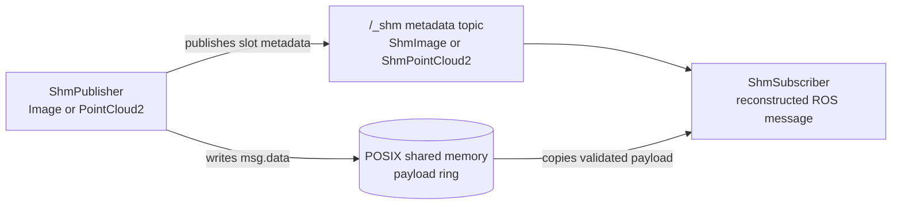
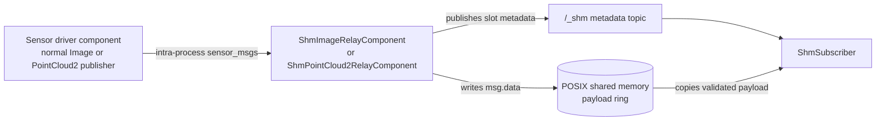

# shm_sensor_transport

`shm_sensor_transport` is a ROS 2 transport path for high-bandwidth, intra-host
sensor streams. It is intended for image and point-cloud pipelines where local
C++ and Python processes can move large payload bytes through shared memory
instead of sending a full serialized `sensor_msgs/Image` or
`sensor_msgs/PointCloud2` message on every callback.

## Why

Many robotics perception systems split sensor drivers, perception nodes, and
debugging tools across multiple processes on the same host. ROS 2 keeps that
split productive, but very large sensor messages can become expensive when every
local consumer receives the full payload through the normal DDS topic path. The
data is already local to the machine, yet it still has to move through
serialization, message construction, and downstream conversion before user code
can work with the pixels or points.

This package adds a local fast path for supported sensor messages:

- C++ and Python publishers can write raw payload bytes directly into a
  fixed-size shared-memory ring buffer.
- Publishers emit a small ROS 2 metadata message that identifies the shared
  memory object, slot, sequence, and sensor layout.
- Shared-memory subscribers receive the metadata, copy the selected payload
  bytes from shared memory, validate that the slot was not overwritten during the
  copy, and pass a reconstructed message or loader output to user code.

Subscribers still copy the payload before invoking callbacks. That copy is
intentional: it gives user code normal object lifetimes while allowing the writer
to keep reusing ring-buffer slots.

## Architecture

The transport has three ROS 2 packages:

- `shm_sensor_transport_interfaces`: metadata message definitions shared by the
  C++ and Python packages.
- `shm_sensor_transport`: C++ relay components, shared-memory ring-buffer
  implementation, and C++ publisher/subscriber API.
- `shm_sensor_transport_py`: Python publisher/subscriber API, shared-memory
  handles, and loader plugins.

Direct shared-memory publishing uses one metadata topic and one POSIX shared
memory object:



```text
Sensor driver process
  └── ShmPublisher
        ├── accepts sensor_msgs/Image or sensor_msgs/PointCloud2
        ├── writes msg.data into the next ring-buffer slot
        └── publishes /camera/image_raw/_shm as hidden ShmImage metadata

POSIX shared memory
  └── /dev/shm/ros2_shm_camera_image_raw_<hash>

C++ or Python consumer process
  └── ShmSubscriber
        ├── accepts /camera/image_raw and subscribes to /camera/image_raw/_shm
        ├── opens and caches the shared-memory object
        ├── copies the slot payload into callback-owned memory
        ├── validates slot sequence counters
        └── calls the user callback with a reconstructed message or loader output
```

When a sensor driver already publishes a normal ROS topic and cannot use
`ShmPublisher` directly, a relay component can adapt that topic:

```text
Existing sensor driver process
  └── publishes /camera/image_raw as sensor_msgs/Image

Relay component
  ├── subscribes to /camera/image_raw
  ├── allocates /dev/shm/ros2_shm_camera_image_raw_<hash>
  ├── writes msg.data into the next ring-buffer slot
  └── publishes /camera/image_raw/_shm as hidden ShmImage metadata
```

Point clouds follow the same pattern using `sensor_msgs/PointCloud2` input and
`ShmPointCloud2` metadata.

Publishers derive the metadata topic from the normal topic as `<topic>/_shm`.
This keeps metadata on a predictable hidden ROS topic.

## Shared Memory Model

Each shared-memory publisher owns one shared-memory object. The object contains:

```text
SharedMemoryHeader
SlotHeader[slot_count]
PayloadSlot[slot_count]
```

Every payload slot has the same configured size. If `slot_size_bytes` is zero,
the publisher infers the slot size from the first received message. A slot
sequence counter is odd while the writer is updating the slot and even once the payload is
complete. Readers accept a copy only when the sequence value before and after the
copy is identical and even.

This gives latest-frame behavior suitable for high-rate sensor streams. It does
not provide reliable history for frames whose slots have already been reused.

## Compatibility

The shared-memory stream is a local transport based on hidden ROS metadata
topics:

```text
/camera/image_raw/_shm   shm_sensor_transport_interfaces/ShmImage

/points/_shm             shm_sensor_transport_interfaces/ShmPointCloud2
```

Direct `ShmPublisher` does not publish the original `sensor_msgs/Image` or
`sensor_msgs/PointCloud2` topic. If you need the normal sensor topic to remain
available for ROS tools or remote subscribers, publish it separately or use a
relay with an existing publisher.

## Usage

Publish directly to shared memory from C++ or Python when you control the sensor
publisher code. Use the same topic name on the publisher and subscriber; the API
maps it to a hidden metadata topic:

```text
/camera/image_raw/_shm   shm_sensor_transport_interfaces/ShmImage
```

### Python

Publish a normal ROS image or point-cloud message directly through shared
memory:

```python
from sensor_msgs.msg import Image
from shm_sensor_transport_py import ShmPublisher

pub = ShmPublisher(
    node,
    '/camera/image_raw',
    msg_type=Image,
    slot_count=8,
    slot_size_bytes=0,
)
pub.publish(image_msg)
```

Subscribe with the normal sensor topic. `ShmSubscriber` appends `/_shm` when
needed, and leaves topics that already end with `/_shm` unchanged. To reconstruct
normal ROS image messages:

```python
import rclpy
from rclpy.node import Node

from shm_sensor_transport_py import ShmSubscriber
from shm_sensor_transport_py.loaders import RosImageLoader


class ImageConsumer(Node):
    def __init__(self):
        super().__init__('image_consumer')
        self.sub = ShmSubscriber(
            node=self,
            topic='/camera/image_raw',
            loader=RosImageLoader(),
            callback=self.on_image,
        )

    def on_image(self, msg, meta):
        self.get_logger().info(f'received {msg.width}x{msg.height} from {meta.shm_name}')


rclpy.init()
node = ImageConsumer()
rclpy.spin(node)
node.destroy_node()
rclpy.shutdown()
```

Use `RosPointCloud2Loader` for `sensor_msgs/PointCloud2` messages:

```python
from shm_sensor_transport_py.loaders import RosPointCloud2Loader

sub = ShmSubscriber(
    node=node,
    topic='/points',
    loader=RosPointCloud2Loader(),
    callback=on_cloud,
)
```

Other loaders are available when user code wants NumPy arrays, OpenCV-style image
arrays, Open3D point clouds, or raw bytes instead of ROS message objects.

### C++

Publish a normal ROS image message directly through shared memory:

```cpp
#include <memory>

#include <rclcpp/rclcpp.hpp>
#include <sensor_msgs/msg/image.hpp>

#include "shm_sensor_transport/shm_publisher.hpp"

auto pub = std::make_unique<shm_sensor_transport::ShmImagePublisher>(
  node,
  "/camera/image_raw",
  shm_sensor_transport::ShmPublisherOptions{});

pub->publish(image_msg);
```

Include `shm_sensor_transport/shm_subscriber.hpp` and keep the subscriber object
alive for as long as the node should receive frames:

```cpp
#include <memory>

#include <rclcpp/rclcpp.hpp>
#include <sensor_msgs/msg/image.hpp>

#include "shm_sensor_transport/shm_subscriber.hpp"

class ImageConsumer : public rclcpp::Node
{
public:
  ImageConsumer()
  : rclcpp::Node("image_consumer")
  {
    sub_ = std::make_unique<shm_sensor_transport::ShmImageSubscriber>(
      this,
      "/camera/image_raw",
      [this](
        sensor_msgs::msg::Image::UniquePtr msg,
        const shm_sensor_transport_interfaces::msg::ShmImage & meta)
      {
        RCLCPP_INFO(
          get_logger(), "received %ux%u from %s",
          msg->width, msg->height, meta.shm_name.c_str());
      });
  }

private:
  std::unique_ptr<shm_sensor_transport::ShmImageSubscriber> sub_;
};
```

For point clouds, use `shm_sensor_transport::ShmPointCloud2Subscriber` with a
`sensor_msgs::msg::PointCloud2::UniquePtr` callback. The C++ subscriber accepts
the same normal topic names as the Python API and also appends `/_shm` unless the
topic already points at the metadata topic.

## Relay Components

Use a relay when an existing sensor driver already publishes
`sensor_msgs/Image` or `sensor_msgs/PointCloud2` and you want to add the
shared-memory fast path without modifying that driver. The original sensor topic
continues to come from the existing publisher; the relay only subscribes to it
and publishes shared-memory metadata.



For best relay performance, load the sensor driver component and relay component
into the same component container with intra-process communication enabled:

```python
ComposableNode(
    package='your_sensor_driver_package',
    plugin='your_sensor_driver_package::CameraDriverComponent',
    name='camera_driver',
    parameters=[{
        'image_topic': '/camera/image_raw',
    }],
    extra_arguments=[{'use_intra_process_comms': True}],
),
ComposableNode(
    package='shm_sensor_transport',
    plugin='shm_sensor_transport::ShmImageRelayComponent',
    name='shm_image_relay',
    parameters=[{
        'common.input_topic': '/camera/image_raw',
        'common.slot_count': 8,
        'common.slot_size_bytes': 0,
        'common.publish_status': False,
    }],
    extra_arguments=[{'use_intra_process_comms': True}],
)
```

For point clouds, use `shm_sensor_transport::ShmPointCloud2RelayComponent` and
pass `/points` to the C++ or Python subscriber.

`common.slot_size_bytes` controls the fixed payload capacity of each shared
memory slot. Keep it at `0` to infer the size from the first frame, or set it
explicitly for known fixed-size streams. `common.publish_status` is optional and
defaults to `false`; set it to `true` and provide `common.status_topic` only when
you want periodic transport status messages.

## Benchmarks

The recorded benchmark compares a normal Python `sensor_msgs/Image` subscriber
against a Python `ShmSubscriber` fed by a C++ publisher and relay loaded into one
component container with intra-process communication enabled. Both paths return
ROS image messages to Python and validate deterministic payload bytes, so the
numbers focus on transport cost rather than application logic.

Across the recorded runs, the shared-memory path reduced mean latency and CPU
time most clearly for large payloads. With a 1 MiB image stream at 120 Hz, the
shared-memory subscriber measured about `0.8 ms` mean latency versus `4.7 ms`
for the normal Python subscriber, with lower CPU use in the benchmark process.
At 4 MiB and 30 Hz, the normal subscriber dropped best-effort samples while the
shared-memory path received all requested frames and used substantially less CPU.

See [BENCHMARK.md](BENCHMARK.md) for the exact commands, tables, and additional
payload/rate settings.

## Limits

- Only intra-host communication is supported.
- The relay still receives the original ROS 2 sensor message.
- Subscribers copy payload bytes before invoking user callbacks.
- Overwritten ring-buffer slots are dropped, not recovered.
- Maximum efficiency comes from direct sensor-driver integration with
  `ShmPublisher` rather than a relay subscribed to an existing topic.
