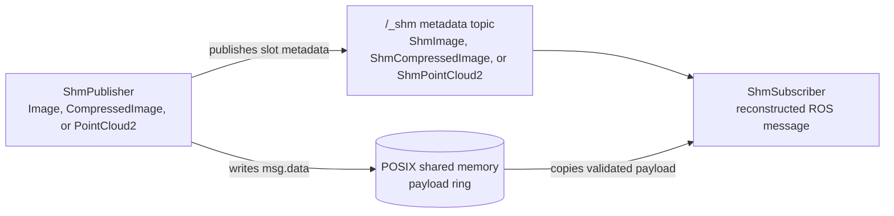

# shm_sensor_transport

`shm_sensor_transport` is a ROS 2 transport path for high-bandwidth, intra-host
sensor streams. It is intended for image, compressed-image, and point-cloud
pipelines where local C++ and Python processes can move large payload bytes
through shared memory instead of sending a full serialized
`sensor_msgs/Image`, `sensor_msgs/CompressedImage`, or
`sensor_msgs/PointCloud2` message on every callback.

## Why

Many robotics perception systems split sensor drivers, perception nodes, and
debugging tools across multiple processes on the same host. ROS 2 keeps that
split productive, but very large sensor messages can become expensive when every
local consumer receives the full payload through the normal DDS topic path. The
data is already local to the machine, yet it still has to move through
serialization, message construction, and downstream conversion before user code
can work with the pixels or points.

This package adds a local fast path for supported sensor messages:

- C++ and Python publishers can write raw payload bytes directly into a
  fixed-size shared-memory ring buffer.
- Publishers emit a small ROS 2 metadata message that identifies the shared
  memory object, slot, sequence, and sensor layout.
- Shared-memory subscribers receive the metadata, copy the selected payload
  bytes from shared memory, validate that the slot was not overwritten during the
  copy, and pass a reconstructed message or loader output to user code.

Subscribers still copy the payload before invoking callbacks. That copy is
intentional: it gives user code normal object lifetimes while allowing the writer
to keep reusing ring-buffer slots.

## Architecture

The repository is split into focused ROS 2 packages:

- `shm_sensor_transport_interfaces`: metadata message definitions shared by the
  C++ and Python packages.
- `shm_sensor_transport`: C++ relay components, shared-memory ring-buffer
  implementation, and direct C++ publisher/subscriber API.
- `shm_sensor_transport_py`: Python publisher/subscriber API, shared-memory
  handles, and loader plugins.
- `image_transport_shm`: `image_transport` plugin that exposes the
  shared-memory image path through the standard image transport API.
- `point_cloud_transport_shm`: `point_cloud_transport` plugin that exposes the
  shared-memory point-cloud path through the standard point cloud transport API.
- `adapted_image_transport`: header-only type-adapted image publisher and
  subscriber wrappers with public `image_transport` compatibility and a private
  same-process intra-process path.
- `adapted_point_cloud_transport`: header-only type-adapted point-cloud
  publisher and subscriber wrappers with public `point_cloud_transport`
  compatibility and a private same-process intra-process path.
- `shm_sensor_transport_rviz`: RViz integration for inspecting streams carried
  by the shared-memory transport.
- `shm_sensor_transport_test`: test support and integration coverage for the
  shared-memory transport packages.

Direct shared-memory publishing uses one metadata topic and one POSIX shared
memory object:



```text
Sensor driver process
  └── ShmPublisher
        ├── accepts sensor_msgs/Image, sensor_msgs/CompressedImage, or sensor_msgs/PointCloud2
        ├── writes msg.data into the next ring-buffer slot
        └── publishes /camera/image_raw/_shm as hidden ShmImage metadata

POSIX shared memory
  └── /dev/shm/ros2_shm_camera_image_raw_<hash>

C++ or Python consumer process
  └── ShmSubscriber
        ├── accepts /camera/image_raw and subscribes to /camera/image_raw/_shm
        ├── opens and caches the shared-memory object
        ├── copies the slot payload into callback-owned memory
        ├── validates slot sequence counters
        └── calls the user callback with a reconstructed message or loader output
```

When a sensor driver already publishes a normal ROS topic and cannot use
`ShmPublisher` directly, a relay component can adapt that topic:

```text
Existing sensor driver process
  └── publishes /camera/image_raw as sensor_msgs/Image

Relay component
  ├── subscribes to /camera/image_raw
  ├── allocates /dev/shm/ros2_shm_camera_image_raw_<hash>
  ├── writes msg.data into the next ring-buffer slot
  └── publishes /camera/image_raw/_shm as hidden ShmImage metadata
```

Compressed images and point clouds follow the same pattern using
`sensor_msgs/CompressedImage` with `ShmCompressedImage` metadata and
`sensor_msgs/PointCloud2` with `ShmPointCloud2` metadata. Compressed image
payloads stay compressed: the transport preserves `format` and moves `data`
bytes through shared memory unchanged.

Publishers derive the metadata topic from the normal topic as `<topic>/_shm`.
This keeps metadata on a predictable hidden ROS topic.

## Shared Memory Model

Each shared-memory publisher owns one shared-memory object. The object contains:

```text
SharedMemoryHeader
SlotHeader[slot_count]
PayloadSlot[slot_count]
```

Every payload slot has the same configured size. If `slot_size_bytes` is zero,
the publisher infers the slot size from the first received message. A slot
sequence counter is odd while the writer is updating the slot and even once the payload is
complete. Readers accept a copy only when the sequence value before and after the
copy is identical and even.

This gives latest-frame behavior suitable for high-rate sensor streams. It does
not provide reliable history for frames whose slots have already been reused.

## Compatibility

The shared-memory stream is a local transport based on hidden ROS metadata
topics:

```text
/camera/image_raw/_shm   shm_sensor_transport_interfaces/ShmImage

/camera/image_raw/compressed/_shm
                         shm_sensor_transport_interfaces/ShmCompressedImage

/points/_shm             shm_sensor_transport_interfaces/ShmPointCloud2
```

Direct `ShmPublisher` does not publish the original `sensor_msgs/Image` or
`sensor_msgs/CompressedImage` or `sensor_msgs/PointCloud2` topic. If you need
the normal sensor topic to remain available for ROS tools or remote subscribers,
publish it separately or use a relay with an existing publisher.

## Type adapters

ROS 2 [REP-2007](https://ros.org/reps/rep-2007.html) type adapters let C++
publishers and subscribers use application-specific data types while preserving
a normal ROS message type at the topic boundary.

This repository includes `adapted_image_transport` and
`adapted_point_cloud_transport`, header-only wrappers around the standard
`image_transport` and `point_cloud_transport` APIs. Same-process consumers can
receive the adapted C++ type through ROS 2 intra-process communication, while
external consumers and ROS tools continue to use the normal public transport
topics.

## Usage

Package-specific usage now lives with the ROS package that owns each API:

- Direct C++ publishers, subscribers, and relay components:
  [`shm_sensor_transport`](shm_sensor_transport/README.md)
- Python publishers, subscribers, and loaders:
  [`shm_sensor_transport_py`](shm_sensor_transport_py/README.md)
- `image_transport` plugin with transport name `shm`:
  [`image_transport_shm`](image_transport_shm/README.md)
- `point_cloud_transport` plugin with transport name `shm`:
  [`point_cloud_transport_shm`](point_cloud_transport_shm/README.md)
- Same-process type-adapted image transport:
  [`adapted_image_transport`](adapted_image_transport/README.md)
- Same-process type-adapted point-cloud transport:
  [`adapted_point_cloud_transport`](adapted_point_cloud_transport/README.md)
- Metadata message definitions:
  [`shm_sensor_transport_interfaces`](shm_sensor_transport_interfaces/README.md)
- RViz displays:
  [`shm_sensor_transport_rviz`](shm_sensor_transport_rviz/README.md)
- Integration tests and benchmark runner:
  [`shm_sensor_transport_test`](shm_sensor_transport_test/README.md)

## Benchmarks

The recorded benchmark compares a normal Python `sensor_msgs/Image` subscriber
against a Python `ShmSubscriber` fed by a C++ publisher and relay loaded into one
component container with intra-process communication enabled. Both paths return
ROS image messages to Python and validate deterministic payload bytes, so the
numbers focus on transport cost rather than application logic.

Across the recorded runs, the shared-memory path reduced mean latency and CPU
time most clearly for large payloads. With a 1 MiB image stream at 120 Hz, the
shared-memory subscriber measured about `0.8 ms` mean latency versus `4.7 ms`
for the normal Python subscriber, with lower CPU use in the benchmark process.
At 4 MiB and 30 Hz, the normal subscriber dropped best-effort samples while the
shared-memory path received all requested frames and used substantially less CPU.

See [BENCHMARK.md](BENCHMARK.md) for the exact commands, tables, and additional
payload/rate settings.

## Limits

- Only intra-host communication is supported.
- The relay still receives the original ROS 2 sensor message.
- Subscribers copy payload bytes before invoking user callbacks.
- Overwritten ring-buffer slots are dropped, not recovered.
- Maximum efficiency comes from direct sensor-driver integration with
  `ShmPublisher` rather than a relay subscribed to an existing topic.
